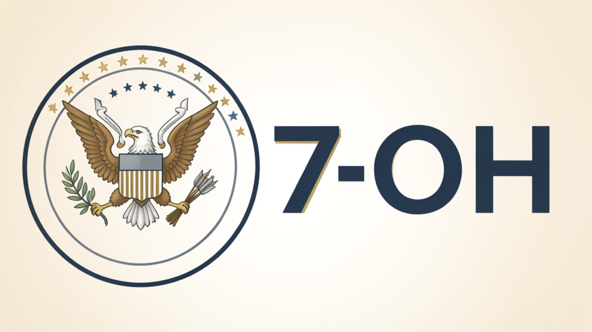

# SAMPA cover images — official agency / policy announcements

**Purpose:** Produce consistent, publishable cover art for news posts about **DEA, FDA, SAMHSA, HHS, NIH, CDC, ASAM policy, Federal Register**, and similar institutional sources.  
**House reference (target look):** the canonical example below — polished editorial digital illustration, dual-talon federal-style emblem (left) + short topic lockup (right).  
**Not for:** pure clinical trials, street/clinical scenes, or pop-art one-offs (use other cover recipes).

**Last updated:** 2026-07-12

---

## Canonical visual reference

**Use this image as the gold standard.** New agency/policy covers should match its layout, polish, emblem grammar, and restraint (not a pixel-perfect clone of the eagle, but the same system).



| Field | Value |
|-------|--------|
| **File in repo** | [`docs/assets/cover-agency-reference-dual-talon-7oh.png`](assets/cover-agency-reference-dual-talon-7oh.png) |
| **Size** | 1600 × 900 (16:9) |
| **Origin** | Approved cover for draft `dea-temporary-schedule-7-oh-kratom-alkaloids-2026-07` (2026-07-12) |
| **Also on storage** | `post-images/caf94722-567a-4ce7-9c07-4dd8033cc129.png` (do not rely on this alone — prefer the repo file) |

### What to match from the reference

1. **Polish** — smooth digital illustration, not rough pen sketch  
2. **Split layout** — emblem mass on the **left**, topic lockup on the **right**  
3. **Emblem grammar** — circular badge, eagle, **both talons occupied** (olive + arrows), shield, stars; **no lettering inside the badge**  
4. **Lockup** — short, bold, only the topic string (here: `7-OH`)  
5. **Palette** — navy / charcoal / cream / soft gold accents  
6. **Mood** — calm, institutional, clinical-adjacent  

### For image generators that accept a reference image

Pass the repo file (or its public URL after clone) as a **style/composition reference**, with instructions:

- Match layout, finish, and emblem rules from the reference  
- Replace the right-side lockup with the new `{{LOCKUP}}`  
- Do **not** copy any official seal; keep emblem text-free  
- Output 16:9  

If the tool only accepts a URL, use the raw GitHub URL after push, e.g.  
`https://raw.githubusercontent.com/jluftig/sampa-website/main/docs/assets/cover-agency-reference-dual-talon-7oh.png`  
(or the storage URL above as fallback).

---

## 1. What “house style” means here

| Attribute | Spec |
|-----------|------|
| Medium | **Polished editorial digital illustration** (smooth shading, clean edges) |
| Not | Rough pen sketch, photo, photoreal people, comic pop-art (unless a different recipe is chosen) |
| Aspect | **16:9** only (news cards use `object-cover`) |
| Export size | **1600 × 900 px** preferred (min 1280 × 720) |
| Format | PNG or JPG |
| Text on image | **Only** the short topic lockup (see §3). **No** mottos, fake Latin, agency names, or gibberish in the emblem |

Live posts show more than one visual language (e.g. pop-art 7-OH; soft Capitol illustration; clinical scenes). **This guide locks the agency/policy lane** so automated covers stay consistent.

---

## 2. Default layout (agency / policy)

```
┌──────────────────────────────────────────────────────────┐
│  16:9                                                      │
│  ┌─────────────┐         ┌─────────────────────────────┐ │
│  │             │         │                             │ │
│  │   EMBLEM    │         │      TOPIC LOCKUP           │ │
│  │   (left)    │         │      (right)                │ │
│  │             │         │                             │ │
│  └─────────────┘         └─────────────────────────────┘ │
│     ~35–40% width              ~55–60% width             │
└──────────────────────────────────────────────────────────┘
```

- **Left (~⅓–⅖):** stylized **federal-energy emblem** (see §4)  
- **Right (~⅗–⅔):** **short topic text** only (e.g. `7-OH`, `MOTAA`, `XR-BUP`)  
- Vertically centered; calm negative space; no clutter  

---

## 3. Topic lockup (right side)

| Rule | Detail |
|------|--------|
| Content | 1 short string: drug class, bill acronym, or substance name |
| Examples | `7-OH` · `MOUD` · `XR-BUP` · `OTP` · `Part 2` |
| Forbidden | Full headlines, “DEA”, “FDA”, long phrases, em dashes, decorative hyphens after the lockup |
| Typography feel | Bold, clean, highly legible (modern geometric / condensed sans energy) |
| AI prompt tip | Spell the exact string: `reading exactly: 7-OH` and `no em dash, no extra characters` |

If no good short lockup exists, use emblem-only centered or a single abstract institutional symbol — **do not** invent junk lettering.

---

## 4. Emblem (left side) — dual-talon federal energy

### Required iconography (classic seal grammar, not a real seal)

- Circular (or slightly oval) **badge / ring**  
- Heraldic **eagle**, head in profile or three-quarter  
- **Both talons occupied** (do not leave one empty):  
  - One talon: **olive branch**  
  - Other talon: **bundle of arrows**  
- Optional: simple **escutcheon/shield** on the breast; small **stars** in an arc; clean geometric border  

### Forbidden

- **Any official agency seal** (DEA, FDA, HHS, DOJ, etc.) or near-copy  
- **Any text inside the emblem** (motto bands, “E PLURIBUS…”, fake Latin, micro-gibberish, numbers)  
- Agency names, logos, wordmarks  
- Implying endorsement or official sponsorship  

**Caption suggestion (posts):**  
`Editorial illustration: stylized dual-talon emblem and [LOCKUP]; not an official seal.`

Legal note: unauthorized use of real federal seals can be unlawful; stylized inspired emblems only.

---

## 5. Color & finish

| Element | Guidance |
|---------|----------|
| Palette | Navy, charcoal, slate blue, soft gold/brass accents, cream or cool off-white ground |
| Finish | Smooth digital illustration, soft gradients OK; avoid heavy paper-grain sketch texture |
| Mood | Authoritative, clinical-adjacent, calm — not alarmist red-alert posters |
| Background | Simple gradient or flat institutional field; no busy photo scenes |

---

## 6. Master image prompt (copy / adapt)

**Prefer image-to-image / reference mode** when available: attach  
`docs/assets/cover-agency-reference-dual-talon-7oh.png` and instruct the model to match that system while changing only the lockup/subject.

Replace `{{LOCKUP}}` and optional `{{SUBJECT_HINT}}`.

```
Use the provided reference image as the visual system for a SAMPA medical nonprofit news cover. Match its polished editorial digital illustration style, left emblem / right lockup layout, dual-talon eagle grammar, navy-charcoal-cream-gold palette, and calm institutional mood. Do NOT copy any real agency seal.

Change only what is needed for this story:
- Keep LEFT: text-free circular federal-energy emblem; eagle with BOTH talons occupied (olive branch + arrows); shield and stars OK; ZERO letters or mottos inside the emblem.
- RIGHT: large bold clean lettering reading exactly: {{LOCKUP}}
  No em dash, no hyphen tail, no other words on the image.

16:9 landscape, publishable quality. {{SUBJECT_HINT}}
No people, no watermarks, no gibberish text, no agency logos.
```

**Text-only fallback** (no reference attachment):

```
Polished professional editorial digital illustration for a medical nonprofit news website (SAMPA), 16:9 landscape, high-quality clean illustration (smooth shading, refined linework — NOT rough pen sketch, NOT photo, NOT comic pop-art). Match the SAMPA agency-cover system: LEFT dual-talon text-free emblem, RIGHT short lockup.

Layout: LEFT 35–40% — refined circular federal-style emblem with heraldic eagle; BOTH talons occupied in classical fashion: one talon gripping an olive branch, the other gripping a bundle of arrows; optional simple shield on chest and stars in an arc; clean geometric ring border. ZERO text, letters, numbers, mottos, or fake Latin anywhere inside the emblem — completely text-free. Inspired by US federal seal energy but NOT a copy of the DEA seal or any real government seal.

RIGHT 55–60% — large bold clean modern lettering reading exactly: {{LOCKUP}}
No em dash, no hyphen tail, no other words on the image.

Palette: navy, charcoal, slate, soft gold accents, cream background. Calm authoritative clinical-institutional mood. {{SUBJECT_HINT}}

No people, no watermarks, no gibberish text, no agency logos. Centered vertical balance, publishable news-card cover.
```

**Examples**

| Story | LOCKUP | SUBJECT_HINT (optional) |
|-------|--------|-------------------------|
| DEA 7-OH scheduling | `7-OH` | (reference image already uses this lockup) |
| Methadone / OTP policy | `OTP` | — |
| Buprenorphine telehealth rule | `MOUD` | — |
| Contingency management | `CM` | — |

After generation: resize to **1600×900**, upload to Supabase `post-images`, set `cover_image_url` + caption on the **draft**.

---

## 7. Pipeline steps (automation)

1. Decide post is **agency/policy** → use **this** guide (not clinical-scene recipe).  
2. Choose `LOCKUP` (≤ ~8 characters ideal; max ~12).  
3. Generate with master prompt.  
4. QA checklist (§8). If fail → regenerate once with stricter “ZERO text in emblem / both talons”.  
5. Upload + attach to draft (`cover_image_url`).  
6. Never block draft insert if image fails — leave cover null and note in notify.

**v1 automation:** Hermes `image_generate` → resize (`sips` / equivalent) → storage upload with secret key → update draft row.

---

## 8. QA checklist (before attach)

- [ ] 16:9 (or cropped to 16:9 without cutting lockup or eagle)  
- [ ] Emblem on **left**, lockup on **right**  
- [ ] Eagle has **both** talons holding branch + arrows  
- [ ] **No** text/gibberish inside emblem  
- [ ] Lockup is **exactly** intended string (no em dash)  
- [ ] Not an official seal clone  
- [ ] Polished illustration (not rough sketch)  
- [ ] File ~1600×900  

---

## 9. When *not* to use this recipe

| Story type | Prefer instead |
|------------|----------------|
| RCT / clinical findings | Clean clinical illustration, abstract data/molecule, or soft scene (no fake seals) |
| Street medicine / ED care | Polished scene illustration (people OK if non-identifiable, house editorial quality) |
| Already-published pop-art treatment | Match that post’s established art only if updating the same article |
| Pure opinion / commentary | Softer abstract institutional art |

---

## 10. Related files

- News pipeline: `docs/sampa-news-scout-prompt.md`, `docs/PARK-news-pipeline.md`  
- Post writing: `.claude/skills/sampa-post/SKILL.md`  
- Insert drafts: `scripts/insert-sampa-draft.mjs`, `scripts/run-insert-draft.sh`  
- Storage bucket: `post-images` (public read; upload via editor or secret-key script)

---

*Approved visual direction: 2026-07-12 (7-OH dual-talon + lockup cover on draft `dea-temporary-schedule-7-oh-kratom-alkaloids-2026-07`).*
